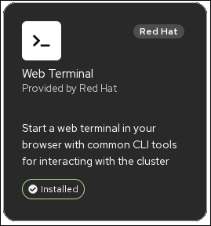
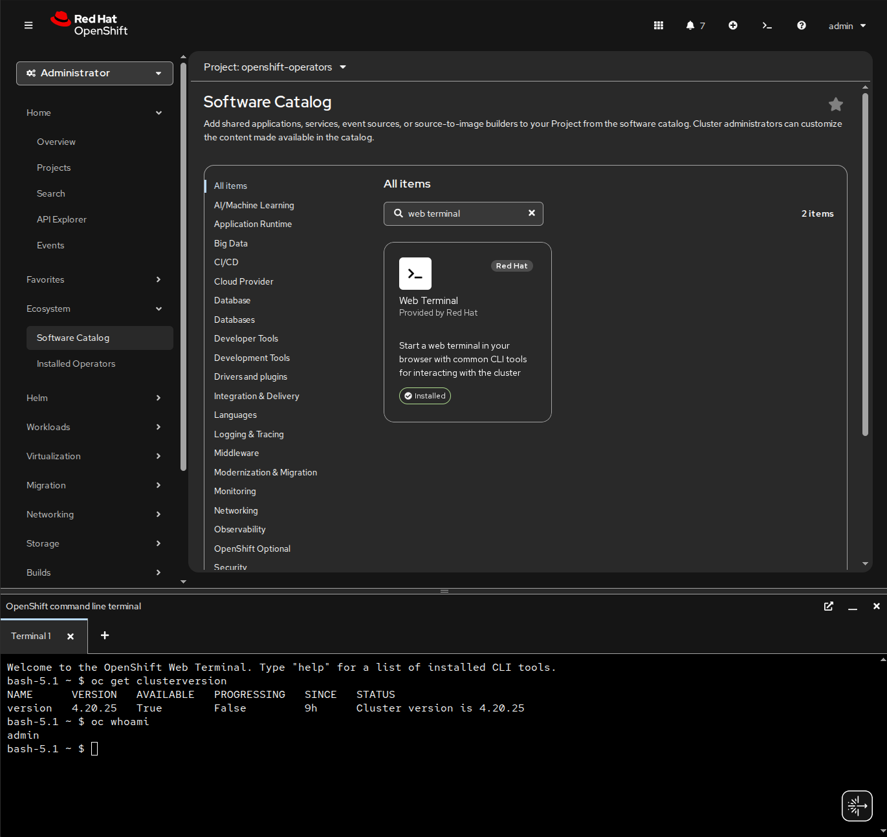

# Web Terminal Operator

The **Web Terminal Operator** enables browser-based access to an OpenShift command-line terminal directly from the OpenShift web console. It creates ephemeral terminal pods on demand, allowing users to interact with the cluster using the `oc` CLI without requiring a local installation. The operator integrates with OpenShift authentication and RBAC, ensuring that terminal sessions inherit the user's existing permissions and access controls.






```
tbd
```

