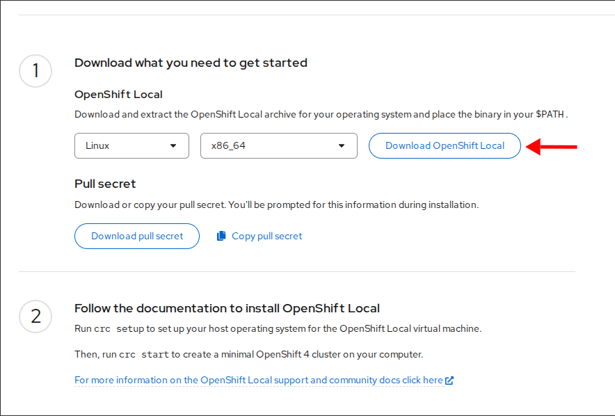
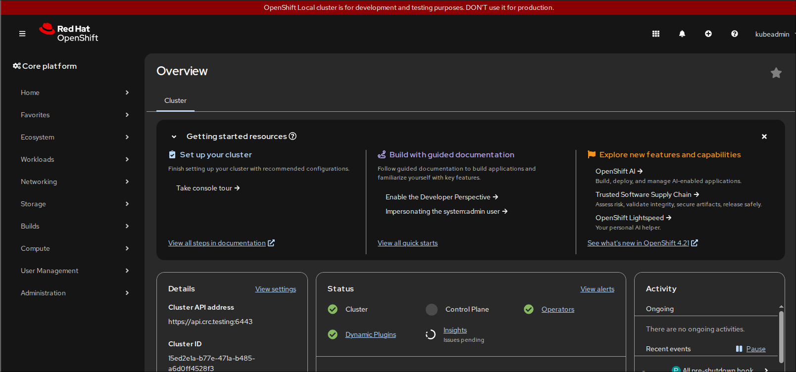

# Red OpenShift Local
* https://developers.redhat.com/products/openshift-local
* https://crc.dev/docs/using/

## Installation

* Download link https://console.redhat.com/openshift/create/local



```
%> tar -xvf crc-linux-amd64.tar.xz 
crc-linux-2.61.0-amd64/
crc-linux-2.61.0-amd64/LICENSE
crc-linux-2.61.0-amd64/crc
```

`crc setup`
```bash title="crc"
 ./crc setup
CRC is constantly improving and we would like to know more about usage (more details at https://developers.redhat.com/article/tool-data-collection)
Your preference can be changed manually if desired using 'crc config set consent-telemetry <yes/no>'
Would you like to contribute anonymous usage statistics? [y/N]: y
Thanks for helping us! You can disable telemetry with the command 'crc config set consent-telemetry no'.
INFO Using bundle path /home/ggomezsa/.crc/cache/crc_libvirt_4.21.14_amd64.crcbundle 
INFO Checking if running as non-root              
INFO Checking if running inside WSL2              
INFO Checking if crc-admin-helper executable is cached 
INFO Caching crc-admin-helper executable          
INFO Using root access: Changing ownership of /home/ggomezsa/.crc/bin/crc-admin-helper-linux-amd64 
[sudo] password for ggomezsa: 
INFO Using root access: Setting suid for /home/ggomezsa/.crc/bin/crc-admin-helper-linux-amd64 
INFO Checking if running on a supported CPU architecture 
INFO Checking if crc executable symlink exists    
INFO Creating symlink for crc executable          
INFO Checking minimum RAM requirements            
INFO Checking if Virtualization is enabled        
INFO Checking if KVM is enabled                   
INFO Checking if libvirt is installed             
INFO Checking if user is part of libvirt group    
INFO Adding user to libvirt group                 
INFO Using root access: Adding user to the libvirt group 
INFO Checking if active user/process is currently part of the libvirt group 
INFO Checking if libvirt daemon is running        
INFO Checking if a supported libvirt version is installed 
INFO Checking if crc-driver-libvirt is installed  
INFO Installing crc-driver-libvirt                
INFO Checking crc daemon systemd service          
INFO Setting up crc daemon systemd service        
INFO Checking crc daemon systemd socket units     
INFO Setting up crc daemon systemd socket units   
INFO Checking if vsock is correctly configured    
INFO Setting up vsock support                     
INFO Using root access: Setting CAP_NET_BIND_SERVICE capability for /home/ggomezsa/red-hat-openshift-local/crc-linux-2.61.0-amd64/crc executable 
INFO Using root access: Creating udev rule for /dev/vsock 
INFO Using root access: Changing permissions for /etc/udev/rules.d/99-crc-vsock.rules to 644  
INFO Using root access: Reloading udev rules database 
INFO Using root access: Loading vhost_vsock kernel module 
INFO Using root access: Creating file /etc/modules-load.d/vhost_vsock.conf 
INFO Using root access: Changing permissions for /etc/modules-load.d/vhost_vsock.conf to 644  
INFO Checking if CRC bundle is extracted in '$HOME/.crc' 
INFO Checking if /home/ggomezsa/.crc/cache/crc_libvirt_4.21.14_amd64.crcbundle exists 
INFO Getting bundle for the CRC executable        
INFO Downloading bundle: /home/ggomezsa/.crc/cache/crc_libvirt_4.21.14_amd64.crcbundle...
5.86 GiB / 5.86 GiB [-------------------------------------------------------------------------------------------] 100.00% 17.90 MiB/s
INFO Uncompressing /home/ggomezsa/.crc/cache/crc_libvirt_4.21.14_amd64.crcbundle 
INFO Uncompressing /home/ggomezsa/.crc/cache/crc_libvirt_4.21.14_amd64.crcbundle 
crc.qcow2:  2.60 GiB / 23.01 GiB [-----------------------------------------------------------------] 100.00%
oc:  133.49 MiB / 133.49 MiB [---------------------------------------------------------------------] 100.00%
Your system is correctly setup for using CRC. Use 'crc start' to start the instance

%> pwd
/home/ggomezsa/.crc
%> tree .
.
├── bin
│   ├── crc -> /home/ggomezsa/red-hat-openshift-local/crc-linux-2.61.0-amd64/crc
│   ├── crc-admin-helper-linux-amd64
│   └── crc-driver-libvirt-amd64
├── cache
│   ├── crc_libvirt_4.21.14_amd64
│   │   ├── crc-bundle-info.json
│   │   ├── crc.qcow2
│   │   ├── id_ecdsa_crc
│   │   ├── kubeconfig
│   │   └── oc
│   └── crc_libvirt_4.21.14_amd64.crcbundle
├── crc-http.sock
├── crc.json
├── crc.log
└── segmentIdentifyHash

4 directories, 13 files

%> bin/crc -h
CRC is a tool that manages a local OpenShift 4.x cluster optimized for testing and development purposes

Usage:
  crc [flags]
  crc [command]

Available Commands:
  bundle              Manage CRC bundles
  cleanup             Undo config changes
  completion          Generate the autocompletion script for the specified shell
  config              Modify crc configuration
  console             Open the OpenShift Web Console in the default browser
  delete              Delete the instance
  generate-kubeconfig Generate a kubeconfig file for the CRC instance
  help                Help about any command
  ip                  Get IP address of the running OpenShift cluster
  oc-env              Add the 'oc' executable to PATH
  podman-env          Setup podman environment
  setup               Set up prerequisites for using CRC
  start               Start the instance
  status              Display status of the OpenShift cluster
  stop                Stop the instance
  version             Print version information

Flags:
  -h, --help               help for crc
      --log-level string   log level (e.g. "debug | info | warn | error") (default "info")

Use "crc [command] --help" for more information about a command.

 %> bin/crc start -p ./pull-secret.txt 
INFO Using bundle path /home/ggomezsa/.crc/cache/crc_libvirt_4.21.14_amd64.crcbundle 
INFO Checking if running as non-root              
INFO Checking if running inside WSL2              
INFO Checking if crc-admin-helper executable is cached 
INFO Checking if running on a supported CPU architecture 
INFO Checking if crc executable symlink exists    
INFO Checking minimum RAM requirements            
INFO Checking if Virtualization is enabled        
INFO Checking if KVM is enabled                   
INFO Checking if libvirt is installed             
INFO Checking if user is part of libvirt group    
INFO Checking if active user/process is currently part of the libvirt group 
INFO Checking if libvirt daemon is running        
INFO Checking if a supported libvirt version is installed 
INFO Checking if crc-driver-libvirt is installed  
INFO Checking crc daemon systemd socket units     
INFO Checking if vsock is correctly configured    
INFO Loading bundle: crc_libvirt_4.21.14_amd64... 
INFO Creating CRC VM for OpenShift 4.21.14...     
INFO Generating new SSH key pair...               
INFO Generating new password for the kubeadmin user 
INFO Starting CRC VM for openshift 4.21.14...     
INFO CRC instance is running with IP 127.0.0.1    
INFO CRC VM is running                            
INFO Updating authorized keys...                  
INFO Configuring shared directories               
INFO Check internal and public DNS query...       
INFO Check DNS query from host...                 
INFO Verifying validity of the kubelet certificates... 
INFO Starting kubelet service                     
INFO Waiting for kube-apiserver availability... [takes around 2min] 
INFO Adding user's pull secret to the cluster...            
INFO Updating SSH key to machine config resource... 
INFO Overriding password for developer user       
INFO Changing the password for the users          
INFO Updating cluster ID...                       
INFO Updating root CA cert to admin-kubeconfig-client-ca configmap... 
INFO Starting openshift instance... [waiting for the cluster to stabilize] 
INFO 9 operators are progressing: console, dns, image-registry, ingress, kube-storage-version-migrator, ... 
INFO 5 operators are progressing: authentication, console, image-registry, ingress, network 
INFO All operators are available. Ensuring stability... 
INFO Operators are stable (2/3)...                
INFO Operators are stable (3/3)...                
INFO Waiting until the user's pull secret is written to the instance disk... 
INFO Adding crc-admin and crc-developer contexts to kubeconfig... 
Started the OpenShift cluster.

The server is accessible via web console at:
  https://console-openshift-console.apps-crc.testing

Log in as administrator:
  Username: kubeadmin
  Password: DUh4u-qtE3D-RDNJo-KL645

Log in as user:
  Username: developer
  Password: developer

Use the 'oc' command line interface:
  $ eval $(crc oc-env)
  
  
%> oc login -u kubeadmin -p DUh4u-qtE3D-RDNJo-KL645  https://api.crc.testing:6443
Login successful.

You have access to 65 projects, the list has been suppressed. You can list all projects with 'oc projects'

Using project "default".
%> oc get nodes
NAME   STATUS   ROLES                         AGE   VERSION
crc    Ready    control-plane,master,worker   12d   v1.34.6

```


```bash
%> bin/crc status
CRC VM:          Running
OpenShift:       Running (v4.21.14)
RAM Usage:       7.403GB of 10.95GB
Disk Usage:      26.99GB of 32.68GB (Inside the CRC VM)
Cache Usage:     31.14GB
Cache Directory: /home/ggomezsa/.crc/cache

$ bin/crc start
INFO Using bundle path /home/ggomezsa/.crc/cache/crc_libvirt_4.21.14_amd64.crcbundle 
INFO Checking if running as non-root              
INFO Checking if running inside WSL2              
INFO Checking if crc-admin-helper executable is cached 
INFO Checking if running on a supported CPU architecture 
INFO Checking if crc executable symlink exists    
INFO Checking minimum RAM requirements            
INFO Checking if Virtualization is enabled        
INFO Checking if KVM is enabled                   
INFO Checking if libvirt is installed             
INFO Checking if user is part of libvirt group    
INFO Checking if active user/process is currently part of the libvirt group 
INFO Checking if libvirt daemon is running        
INFO Checking if a supported libvirt version is installed 
INFO Checking if crc-driver-libvirt is installed  
INFO Checking crc daemon systemd socket units     
INFO Checking if vsock is correctly configured    
INFO Loading bundle: crc_libvirt_4.21.14_amd64... 
INFO Starting CRC VM for openshift 4.21.14...     
INFO CRC instance is running with IP 127.0.0.1    
INFO CRC VM is running                            
INFO Updating authorized keys...                  
INFO Configuring shared directories               
INFO Check internal and public DNS query...       
INFO Check DNS query from host...                 
INFO Verifying validity of the kubelet certificates... 
INFO Starting kubelet service                     
INFO Waiting for kube-apiserver availability... [takes around 2min] 
INFO Overriding password for developer user       
INFO Starting openshift instance... [waiting for the cluster to stabilize] 
INFO Operator network is progressing              
INFO 3 operators are progressing: console, image-registry, ingress 
INFO All operators are available. Ensuring stability... 
INFO Operators are stable (2/3)...                
INFO Operators are stable (3/3)...                
INFO Waiting until the user's pull secret is written to the instance disk... 
INFO Adding crc-admin and crc-developer contexts to kubeconfig... 
Started the OpenShift cluster.

The server is accessible via web console at:
  https://console-openshift-console.apps-crc.testing

Log in as administrator:
  Username: kubeadmin
  Password: DUh4u-qtE3D-RDNJo-KL645

Log in as user:
  Username: developer
  Password: developer

Use the 'oc' command line interface:
  $ eval $(crc oc-env)
  $ oc login -u developer https://api.crc.testing:6443
```

## Configuring crc

We have `crc config` to manipulate the vm/cluster configuration.

```
$ crc config get disk-size
Configuration property 'disk-size' is not set. Default value '31' is used

$ crc config set disk-size 100
Changes to configuration property 'disk-size' are only applied when the CRC instance is started.
If you already have a running CRC instance, then for this configuration change to take effect, stop the CRC instance with 'crc stop' and restart it with 'crc start'.

; what can be configured
$ crc config help
Modifies crc configuration properties.
Properties: 

* bundle                               Bundle path/URI - absolute or local path, http, https or docker URI (string, like 'https://foo.com/crc_libvirt_4.21.14_amd64.crcbundle', 'docker://quay.io/myorg/crc_libvirt_4.21.14_amd64.crcbundle:2.61.0' default '/home/ggomezsa/.crc/cache/crc_libvirt_4.21.14_amd64.crcbundle' )
* consent-telemetry                    Consent to collection of anonymous usage data (yes/no)
* cpus                                 Number of CPU cores (must be greater than or equal to '4')
* developer-password                   User defined developer password
* disable-update-check                 Disable update check (true/false, default: false)
* disk-size                            Total size in GiB of the disk (must be greater than or equal to '31')
* enable-bundle-quay-fallback          If bundle download from the default location fails, fallback to quay.io (true/false, default: false)
* enable-cluster-monitoring            Enable cluster monitoring Operator (true/false, default: false)
* enable-emergency-login               Enable emergency login for 'core' user. Password is randomly generated. (true/false, default: false)
* enable-experimental-features         Enable experimental features (true/false, default: false)
* enable-shared-dirs                   Mounts the host's home directory into the CRC VM (true/false, default: true)
* host-network-access                  Allow TCP/IP connections from the CRC VM to services running on the host (true/false, default: false)
* http-proxy                           HTTP proxy URL (string, like 'http://my-proxy.com:8443')
* https-proxy                          HTTPS proxy URL (string, like 'https://my-proxy.com:8443')
* ingress-http-port                    HTTP port to use for OpenShift ingress/routes on the host (1024-65535, default: 80)
* ingress-https-port                   HTTPS port to use for OpenShift ingress/routes on the host (1024-65535, default: 443)
* kubeadmin-password                   User defined kubeadmin password
* memory                               Memory size in MiB (must be greater than or equal to '10752')
* modify-hosts-file                    Allow CRC to modify the system hosts file (true/false, default: true)
* nameserver                           IPv4 address of nameserver (string, like '1.1.1.1 or 8.8.8.8')
* network-mode                         Network mode (user or system)
* no-proxy                             Hosts, ipv4 addresses or CIDR which do not use a proxy (string, comma-separated list such as '127.0.0.1,192.168.100.1/24')
* persistent-volume-size               Total size in GiB of the persistent volume used by the CSI driver for microshift preset (must be greater than or equal to '15')
* preset                               Virtual machine preset (valid values are: [microshift openshift okd])
* proxy-ca-file                        Path to an HTTPS proxy certificate authority (CA)
* pull-secret-file                     Path of image pull secret (download from https://console.redhat.com/openshift/create/local)
* skip-check-admin-helper-cached       Skip preflight check (true/false, default: false)
* skip-check-bundle-extracted          Skip preflight check (true/false, default: false)
* skip-check-crc-dnsmasq-file          Skip preflight check (true/false, default: false)
* skip-check-crc-network               Skip preflight check (true/false, default: false)
* skip-check-crc-network-active        Skip preflight check (true/false, default: false)
* skip-check-crc-symlink               Skip preflight check (true/false, default: false)
* skip-check-daemon-systemd-sockets    Skip preflight check (true/false, default: false)
* skip-check-daemon-systemd-unit       Skip preflight check (true/false, default: false)
* skip-check-kvm-enabled               Skip preflight check (true/false, default: false)
* skip-check-libvirt-driver            Skip preflight check (true/false, default: false)
* skip-check-libvirt-group-active      Skip preflight check (true/false, default: false)
* skip-check-libvirt-installed         Skip preflight check (true/false, default: false)
* skip-check-libvirt-running           Skip preflight check (true/false, default: false)
* skip-check-libvirt-version           Skip preflight check (true/false, default: false)
* skip-check-network-manager-config    Skip preflight check (true/false, default: false)
* skip-check-network-manager-installed Skip preflight check (true/false, default: false)
* skip-check-network-manager-running   Skip preflight check (true/false, default: false)
* skip-check-ram                       Skip preflight check (true/false, default: false)
* skip-check-root-user                 Skip preflight check (true/false, default: false)
* skip-check-supported-cpu-arch        Skip preflight check (true/false, default: false)
* skip-check-systemd-networkd-running  Skip preflight check (true/false, default: false)
* skip-check-user-in-libvirt-group     Skip preflight check (true/false, default: false)
* skip-check-virt-enabled              Skip preflight check (true/false, default: false)
* skip-check-vsock                     Skip preflight check (true/false, default: false)
* skip-check-wsl2                      Skip preflight check (true/false, default: false)

Usage:
  crc config SUBCOMMAND [flags]
  crc config [command]

Available Commands:
  get         Get a crc configuration property
  set         Set a crc configuration property
  unset       Unset a crc configuration property
  view        Display all assigned crc configuration properties

Flags:
  -h, --help   help for config

Global Flags:
      --log-level string   log level (e.g. "debug | info | warn | error") (default "info")

Use "crc config [command] --help" for more information about a command.
```

`crc cleanup`
```
%> bin/crc cleanup
INFO Removing vsock configuration                 
INFO Using root access: Removing udev rule in /etc/udev/rules.d/99-crc-vsock.rules 
[sudo] password for ggomezsa: 
INFO Using root access: Removing vsock module autoload file /etc/modules-load.d/vhost_vsock.conf 
INFO Removing 'crc' network from libvirt          
INFO Removing /etc/NetworkManager/dnsmasq.d/crc.conf file 
INFO Removing /etc/NetworkManager/conf.d/crc-nm-dnsmasq.conf file 
INFO Removing crc daemon systemd socket units     
INFO Removing crc daemon systemd service          
INFO Removing crc's virtual machine               
INFO Removing crc libvirt storage pool            
INFO Removing CRC manpages                        
INFO Removing CRC Specific entries from user's known_hosts file 
INFO Removing hosts file records added by CRC     
INFO Removing pull secret from the keyring        
INFO Removing older logs                          
Cleanup finished
```


## Deploy other bundles (versions)
You might want to try another version of OpenShift to test with. Default bundle is hardwired to the`crc` binary so you will need to specificy the bundle to be used or download an older version of `crc`, for bundles look at:
* [mirror.openshift.com](https://mirror.openshift.com/pub/openshift-v4/clients/crc/bundles/openshift/)

```
%> bin/crc config set bundle ~/.crc/bundles/crc_libvirt_4.18.12_amd64.crcbundle 
WARN Using crc_libvirt_4.18.12_amd64.crcbundle bundle, but crc_libvirt_4.21.14_amd64.crcbundle is expected for this release 
Successfully configured bundle to /home/ggomezsa/.crc/bundles/crc_libvirt_4.18.12_amd64.crcbundle

; or do it manually in your json config file
%> cat crc.json 
{
  "bundle": "/home/ggomezsa/.crc/bundles/crc_libvirt_4.18.12_amd64.crcbundle",
  "consent-telemetry": "no",
  "cpus": 8,
  "disk-size": 100,
  "memory": 24576,
  "pull-secret-file": "/home/ggomezsa/.crc/pull-secret.txt"
}

%>bin/crc setup
WARN Using crc_libvirt_4.18.12_amd64.crcbundle bundle, but crc_libvirt_4.21.14_amd64.crcbundle is expected for this release 
INFO Using bundle path /home/ggomezsa/.crc/bundles/crc_libvirt_4.18.12_amd64.crcbundle 
...
```