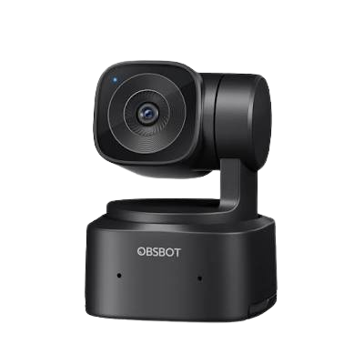
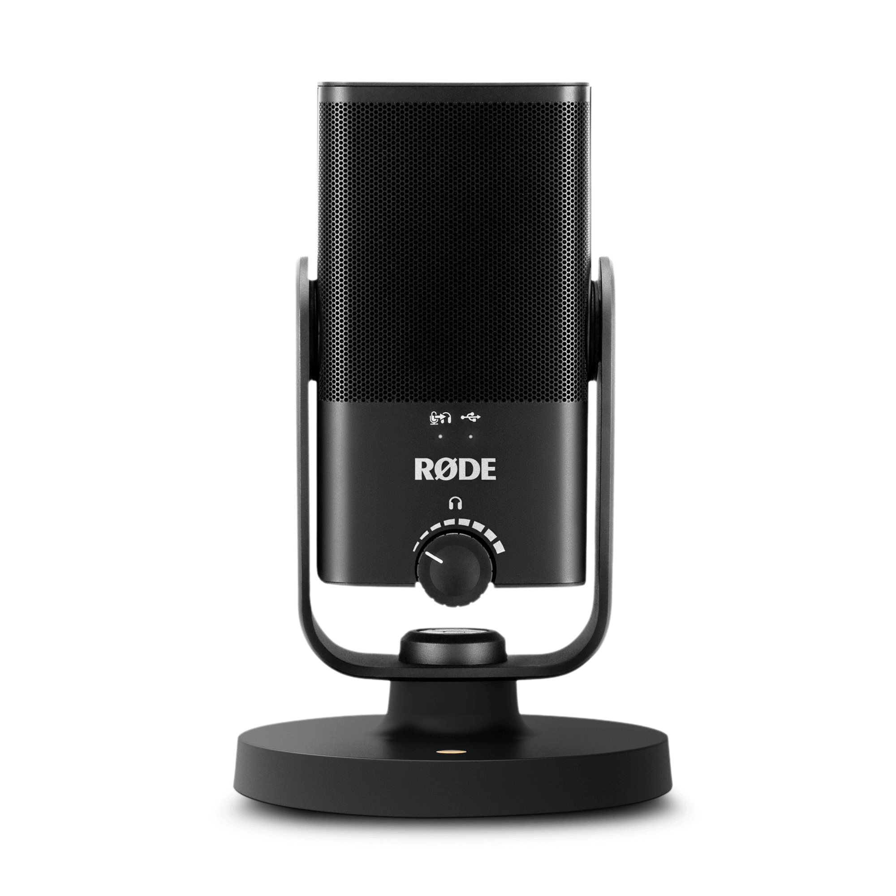

# Recording Fedora Stack

## Cámara

- OBSBOT Tiny SE

## Microphone

- RODE NT USB Mini

## Grabación / streaming

- OBS Studio

## Control bajo nivel

- v4l2-ctl

## Audio/video backend

- PipeWire

# Fedora Desktop
* Hyprland
